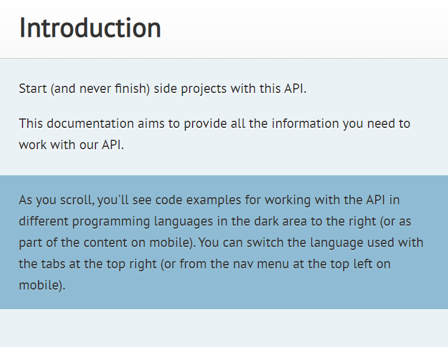

# Adding general information
You can add basics such as the title, introductory text, base URL and authentication information in your `scribe.php` config file.

## Title
To set the HTML `<title>` for the generated docs, use the `title` key. This title will also be used in the Postman collection and OpenAPI spec.

```php title=config/scribe.php
    'title' => 'The SideProject API',
```

If you leave `title` empty, Scribe will infer it from the value of `config('app.name')`.

## Description and introductory text
You can add a description of your API using the `description` key. This description will be displayed in the docs' "Introduction" section, and in the Postman collection and OpenAPI spec.

The `intro_text` key is where you'll set the text shown in the "Introduction" section of your docs (after the `description`).

```php title=config/scribe.php
    'description' => 'Start (and never finish) side projects with this API.',
    'intro_text' => <<<INTRO
This documentation will provide all the information you need to work with our API.

<aside>
As you scroll, you'll see code examples for working with the API in different programming languages in the dark area to the right (or as part of the content on mobile).
You can switch the language used with the tabs at the top right (or from the nav menu at the top left on mobile).
</aside>
INTRO
```



## Base URL
By default, Scribe will use the current app URL (`config('app.url)`) as the base URL in your docs (also known as the _display URL_). However, you can customise this with the `base_url` key. For example, setting the `base_url` to this:

```php title=config/scribe.php
    'base_url' => 'http://sideprojects.knuckles.wtf',
```

...means that `http://sideprojects.knuckles.wtf` will be shown in the generated docs, even if you ran the `generate` command on localhost or in CI.

:::note
You can also set the URL used in the API tester (Try It Out) with the `try_it_out.base_url` key.
:::

## Logo
Maybe you've got a pretty logo for your API or company, and you'd like to display that on your documentation page. No worries! To add a logo, set the `logo` key in `scribe.php` to the path of the logo. Here are your options:

- To point to an image on an external public URL, set `logo` to that URL.
   ```php
   'logo' => 'http://your-company/logo.png',
   ```
- To point to an image in your codebase:
  - if you're using `laravel` type docs, set `logo` to the `public_path()` of the image
  - if you're using `static` type, pass in the path to the image relative to the `public/docs` directory. 

  For example, if your logo is in `public/images`:
   ```php
   // static type
   'logo' => '../img/logo.png',
   // laravel type
   'logo' => 'img/logo.png',
   ```
- If you don't want a logo, set `logo` to `false`.

## Authentication
You can add authentication information for your API using the `auth` section in `scribe.php`. 

:::important
Scribe uses the auth information you specify for four things:
  - Generating an "Authentication" section in your docs
  - Adding auth information to the Postman collection and OpenAPI spec
  - Adding authentication parameters to your example requests for endpoints that use authentication
  - Adding the necessary auth parameters with the specified value to response calls for endpoints that use authentication
:::

Here's how you'd configure auth with a query parameter named `apiKey`:

```php title=config/scribe.php
    'auth' => [
        'enabled' => true,
        'default' => false,
        'in' => 'query',
        'name' => 'apiKey',
        'use_value' => env('SCRIBE_API_KEY'),
        'placeholder' => 'YOUR-API-KEY',
        'extra_info' => 'You can retrieve your key by going to settings and clicking <b>Generate API key</b>.',
    ],
```

If `apiKey` were to be a body parameter, the config would be same. Just set `in` to `'body'`.

Here's an example with a bearer token (also applies to basic auth, if you change `in` to `'basic'`):


```php
    'auth' => [
        'enabled' => true,
        'default' => false,
        'in' => 'bearer',
        'name' => 'hahaha', // <--- This value is ignored for bearer and basic auth
        'use_value' => env('SCRIBE_AUTH_KEY'),
        'placeholder' => '{ACCESS_TOKEN}',
        'extra_info' => 'You can retrieve your token by visiting your dashboard and clicking <b>Generate API token</b>.',
    ],
```

And here's an example with a custom header:


```php
    'auth' => [
        'enabled' => true,
        'default' => false,
        'in' => 'header',
        'name' => 'Api-Key', // <--- The name of the header
        'use_value' => env('SCRIBE_AUTH_KEY'),
        'placeholder' => 'YOUR-API-KEY',
        'extra_info' => 'You can retrieve your token by visiting your dashboard and clicking <b>Generate API token</b>.',
    ],
```
The `default` field is the default behaviour of our API. If your endpoints are authenticated by default, set this to `true`, then use `@unauthenticated` on the method doc block if you need to turn off auth for specific endpoints. If your endpoints are open by default, leave this as `false`, then use `@authenticated` on the method doc block if you need to turn on auth for specific endpoints.

You can set whatever you want as the `extra_info`. A good idea would be to tell your users where to get their auth key. 

The `use_value` field is only used by Scribe for response calls. It won't be included in the generated output or examples.
The `placeholder` is the opposite of `use_value`. It will be used only as a placeholder in the generated example requests.

For more information, see the [reference documentation on the auth section](../config.html#auth).


