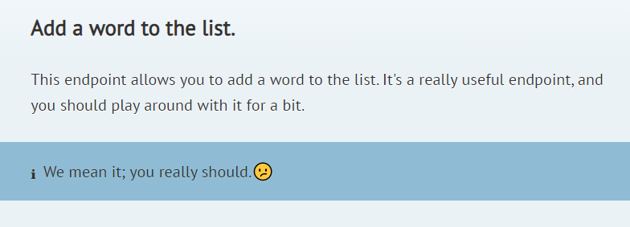

# Adding endpoint metadata
Endpoint metadata is primarily added via docblocks. See [Supported annotations](../reference/annotations) for a comprehensive list.

## Title and description
To set an endpoint's title and description, just write in the method's docblock. The first paragraph is the title, and the rest is the description. There must be a blank line between title and description. Markdown and HTML are also supported (see [HTML helpers](../reference/25-html.md)).

For instance, this:

```php
/**
 * Add a word to the list.
 *
 * This endpoint allows you to add a word to the list.
 * It's a really useful endpoint, and you should play around 
 * with it for a bit.
 * <aside class="notice">We mean it; you really should.😕</aside>
 */
public function store(Request $request)
{
    //...
}
```

becomes:



:::note
For best results, the title and description should come before any annotations (`@-tag`).
:::

## Grouping endpoints
For easy navigation, endpoints in your API are organized by groups. You can add an endpoint to a group by using the `@group` annotation, followed by the name of the group.

:::tip
A better option is often to set `@group` on the controller instead. This will add all endpoints in that controller to the group, and you can add a group description below the group name
:::

```php
/**
 * @group User management
 *
 * APIs for managing users
 */
class UserController extends Controller
{
	/**
	 * Create a user.
	 */
	 public function createUser()
	 {

	 }
	 
	/**
     * Change a user's password.
     * 
	 * @group Account management
	 */
	 public function changePassword()
	 {

	 }
}
``` 


Grouping endpoints is optional. Any endpoints not in a group will be placed in a default group specified in your [config](../reference/10-config.md#default_group).

## Indicating authentication status
If you have `auth.default` set to `false` in your config, your endpoints will be treated as open by default. You can use the `@authenticated` annotation on a method to indicate that the endpoint needs authentication.

Similarly, if you have `auth.default` set to `true` in your config, your endpoints will be treated as authenticated by default. You can use the `@unauthenticated` annotation on a method to indicate that the endpoint is unauthenticated.

```php
    /**
     * Create a user
     *
     * This endpoint lets you create a user.
     * @authenticated
     *
     */
     public function create()
     {    
     }
```

A "Requires authentication" badge will be added to that endpoint in the generated documentation. 


:::tip
Like with `@group`, you can specify `@authenticated` or `@unauthenticated` on the controller so you don't have to write it on each method.
:::
