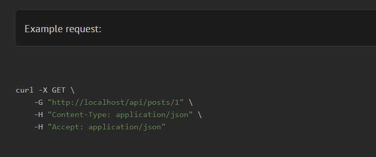

# URL parameters
Scribe automatically extracts details about your URL parameters from your routes. It can figure out the names, required/optional status and sometimes the types of your parameters. However, you can overwrite this information or add new details, such as a description, using the `@urlParam` annotation.

The annotation takes the name of the parameter, an optional type (defaults to "string"), an optional "required" label, and an optional description. Valid types are `string`, `integer`, and `number`. For instance, if you defined your Laravel route like this:

```php
Route::get("/post/{id}/{lang?}");
```

you can describe the `id` and `lang` parameters like this: 

```php
/**
 * @urlParam id integer required The ID of the post.
 * @urlParam lang The language. Example: en
 */
public function getPost()
{
    // ...
}
```

Scribe will generate a random example by default, but you can specify your own value in examples and response calls by ending the description with `Example: <your-example>`, as we did for the `lang` parameter above.

This gives:


If you want Scribe to omit a certain optional parameter (`lang` in our example) in examples and response calls, end the description with `No-example`. It will still be present in the docs.


```php
/**
 * @urlParam id required The ID of the post.
 * @urlParam lang The language. No-example
 */
```


